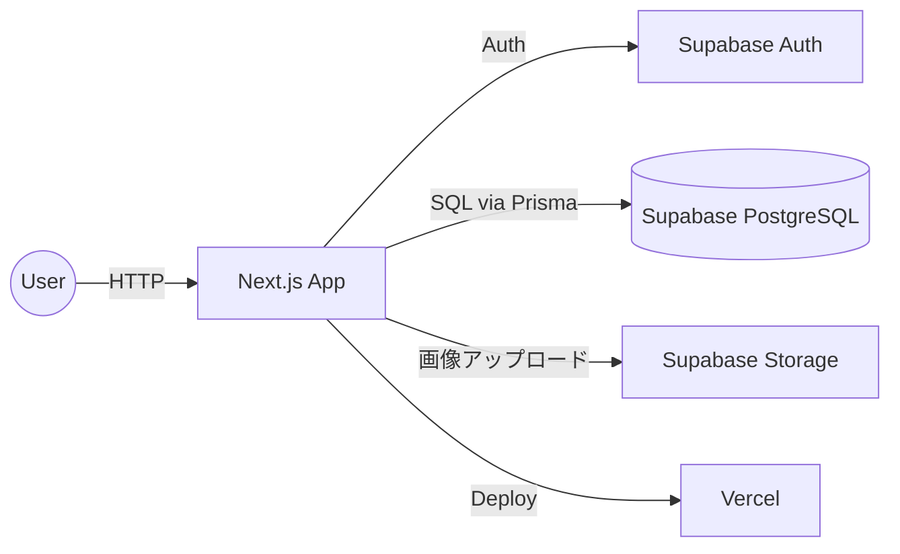

# SutoMemo

[](https://github.com/mashosokana/sutomemo/actions/workflows/e2e.yml)

**学びを画像メモにし、SNS共有までを一続きにするWebサービス**

---

## リンク / すぐ触る

- **本番URL**：https://sutomemo.vercel.app
- **ゲストログイン**：トップの「お試しログイン」ボタンで即体験（メール不要）

---

## このアプリの特徴（3つ）

- **Stories Style Editor** … 画像にテキストを重ねて9:16の画像メモを作成（ドラッグ移動・ピンチ拡縮対応）
- **3ステップで投稿完了** … 画像選択 → テキスト編集 → 保存＆共有
- **X / Threads 共有導線** ＋ **学習メモ（Why/What/Next）** で"ふりかえり"を促進

---

## 機能一覧

| 機能 | 説明 |
|---|---|
| **Stories Style Editor** | 画像にテキストボックスを配置し、9:16（1080x1920px）の画像メモを作成。ドラッグ移動・ピンチ拡縮・HEIC自動変換対応 |
| **編集状態の自動保存** | localStorage に編集中の状態を保存し、ページ離脱しても復元可能 |
| **SNS共有** | X / Threads へのディープリンク共有。モバイルでは Web Share API によるファイル共有・カメラロール保存にも対応 |
| **学習メモ（Why/What/Next）** | 投稿に紐づく振り返りメモで学びを蓄積 |
| **メトリクス記録** | いいね数・コメント数・保存数・シェア数・インプレッション・リーチ・エンゲージメント率を手動記録 |
| **ゲストログイン** | メール登録不要で機能をプレビュー可能（投稿作成・画像アップロードは不可） |
| **管理者機能** | ゲスト投稿管理、投稿オーナー管理（ADMIN ロールのみ） |

---

## 使用技術（Tech Stack）

| Category | Stack |
|---|---|
| Frontend | TypeScript, Next.js 14 (App Router), React 18, Tailwind CSS 3 |
| Backend | Next.js Route Handlers, Prisma 6 |
| BaaS/DB | Supabase (Auth / PostgreSQL / Storage) |
| Validation | Zod |
| Data Fetching | SWR |
| Infra | Vercel（Preview / 本番デプロイ） |
| Test | Playwright（E2E） |
| CI/CD | GitHub Actions（E2E on prod） |
| Others | ESLint, heic2any（iOS画像変換） |

---

## システム構成（Mermaid）



## ER 図（Mermaid）

```mermaid
erDiagram
  User ||--o{ Post : has
  Post ||--o{ Image : has
  Post ||--o| Memo : has
  Post ||--o| Metrics : has

  User {
    uuid id PK
    string email UK
    string password "nullable"
    enum role "USER | ADMIN"
    datetime createdAt
    datetime updatedAt
  }

  Post {
    int id PK
    uuid userId FK
    string caption
    enum status "draft | published | archived | deleted"
    string thumbnailImageKey "nullable"
    datetime createdAt
    datetime updatedAt
  }

  Memo {
    int id PK
    int postId FK-UK
    string answerWhy "nullable"
    string answerWhat "nullable"
    string answerNext "nullable"
    datetime createdAt
    datetime updatedAt
  }

  Image {
    int id PK
    int postId FK
    string imageKey "Supabase Storage path"
    datetime generatedAt
    datetime updatedAt
  }

  Metrics {
    int id PK
    int postId FK-UK
    int likesCount
    int commentsCount
    int savesCount
    int sharesCount
    int impressions
    int reach
    float engagementRate
    string source "manual | api"
    datetime fetchedAt
    datetime createdAt
    datetime updatedAt
  }
```

---

## 開発者向け（セットアップ）

### 必要環境

- Node.js 18+（推奨 20）

### セットアップ

```bash
npm i
cp .env.supabase .env   # 値を自分の環境に合わせて設定
npx prisma generate
npm run dev              # http://localhost:3000
```

### 環境変数

| 変数名 | 用途 | 公開範囲 |
|---|---|---|
| `NEXT_PUBLIC_SUPABASE_URL` | Supabase プロジェクトURL | クライアント |
| `NEXT_PUBLIC_SUPABASE_ANON_KEY` | Supabase 匿名キー | クライアント |
| `SUPABASE_SERVICE_ROLE_KEY` | Supabase サービスロールキー | サーバー専用 |
| `DATABASE_URL` | PostgreSQL 接続文字列（PgBouncer経由） | サーバー専用 |
| `DIRECT_URL` | PostgreSQL 直接接続（マイグレーション用） | サーバー専用 |
| `GUEST_USER_EMAIL` / `GUEST_USER_PASSWORD` | ゲストログイン用アカウント | サーバー専用 |
| `NEXT_PUBLIC_GUEST_EMAIL` / `NEXT_PUBLIC_GUEST_PASSWORD` | ゲストログイン用（クライアント参照） | クライアント |
| `ADMIN_EMAIL` | 管理者自動昇格のメールアドレス | サーバー専用 |
| `NEXT_PUBLIC_APP_URL` | アプリURL（CORS・CSP用） | クライアント |
| `NEXT_PUBLIC_GUEST_SANDBOX_POST_ID` | ゲスト用サンドボックス投稿ID（任意） | クライアント |

---

## テスト / CI

- **目的**：本番URLで**導線が生きているか**のスモーク確認
- **実行**

```bash
# 依存
npm i -D @playwright/test && npx playwright install
# テスト（本番URLに対して）
BASE_URL=https://sutomemo.vercel.app npx playwright test e2e/*.spec.ts
```

- **CI**：`.github/workflows/e2e.yml`（push/PR時に自動実行、バッジ更新）

---

## 今後の展望

1. 画像エディタ強化 … レイヤー管理・位置プリセット・書き出し品質の最適化
2. ファネル計測 … LP → ゲスト → 投稿の導線計測を導入
3. 継続率ダッシュボード … W2/W4の推移と離脱点を可視化
4. 導線最適化 … クリック数・初回投稿までの時間（TTFP）を短縮
5. ワークフロー自動化 … 予約投稿（スケジュール）とリマインドで継続利用を支援
