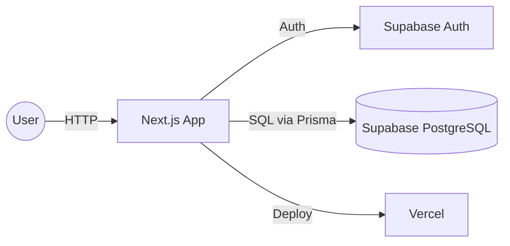
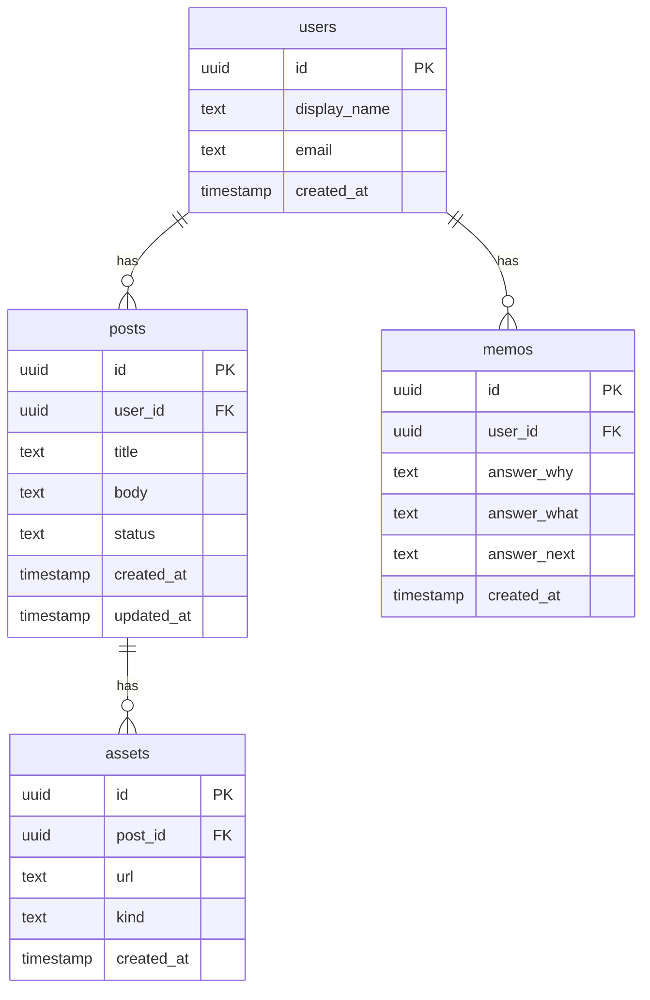

# SutoMemo
[](https://github.com/mashosokana/sutomemo/actions/workflows/e2e.yml)

**学びをメモにし、投稿下書きと画像作成までを一続きにするWebサービス**

---

## リンク / すぐ触る
- **本番URL**：https://sutomemo.vercel.app  
- **ゲストログイン**：トップの「お試しログイン」ボタンで即体験（メール不要）

---

## このアプリの特徴（3つ）
- **LP → ワンクリック体験 → ダッシュボード**（初回30秒想定）
- **投稿下書き生成 / 画像オーバーレイ（ウォーターマーク）**
- **X / Threads 共有導線**＋**学習メモ（Why/What/Next）**で“ふりかえり”を促進

---

## スクリーンショット

<table>
  <tr>
    <th>トップ(LP)</th>
    <th>ダッシュボード</th>
    <th>画像オーバーレイ</th>
  </tr>
  <tr>
    <td></td>
    <td></td>
    <td></td>
  </tr>
</table>


---

## 機能一覧（抜粋）
- **初回体験の最短化**：LP→ワンクリック体験→ダッシュボード
- **投稿下書き生成**：テンプレ×生成APIで“10分でSNS量産”を支援
- **画像オーバーレイ**：キャンバスにテキスト/ロゴを重ねて書き出し
- **共有導線**：X / Threads へ即共有、コピー支援
- **学習メモ（Why/What/Next）**：1フォームで振り返りを蓄積
- **ゲストログイン**：メール不要で中身を確認可能

---

## 使用技術（Tech Stack）
| Category | Stack |
|---|---|
| Frontend | TypeScript, Next.js (App Router), Tailwind CSS, shadcn/ui |
| Backend | Next.js Route Handlers, Prisma |
| BaaS/DB | Supabase (Auth / PostgreSQL / RLS) |
| Infra | Vercel（Preview/本番デプロイ） |
| Test | Playwright（E2E） |
| CI/CD | GitHub Actions（E2E on prod） |
| Design/Docs | Figma, Mermaid |
| Others | ESLint, Prettier |

---

## システム構成（Mermaid）


## ER 図（Mermaid）


---

## 開発者向け（セットアップ）
### 必要環境
- Node.js 18+（推奨 20）

### セットアップ
```bash
npm i
cp .env.example .env   # 値を設定してください
npm run dev            # http://localhost:3000
```

`.env.example` 例：
```dotenv
NEXT_PUBLIC_APP_URL=https://sutomemo.vercel.app
NEXT_PUBLIC_SUPABASE_URL=
NEXT_PUBLIC_SUPABASE_ANON_KEY=
SUPABASE_SERVICE_ROLE_KEY=
OPENAI_API_KEY=
NODE_ENV=development
```

---

## テスト / CI
- **目的**：本番URLで**導線が生きているか**のスモーク確認
- **実行**
```bash
# 依存
npm i -D @playwright/test && npx playwright install
# テスト（本番URLに対して）
BASE_URL=https://sutomemo.vercel.app npx playwright test e2e/*.spec.ts
```
- **CI**：`/.github/workflows/e2e.yml`（push/PR時に自動実行、バッジ更新）

---

## 今後の展望

1. 画像オーバーレイ強化 … レイヤ／位置プリセット、書き出し品質の最適化  
2. 計測の仕込み … LP→ゲスト→投稿のファネル計測を導入  
3. 継続率ダッシュボード … W2/W4の推移と離脱点を可視化  
4. 導線最適化 … クリック数・初回投稿までの時間（TTFP）を短縮／用途別テンプレを少数追加  
5. ワークフロー自動化 … 予約投稿（スケジュール）と軽いリマインドで継続利用を支援

