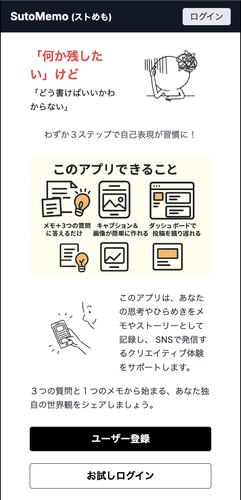
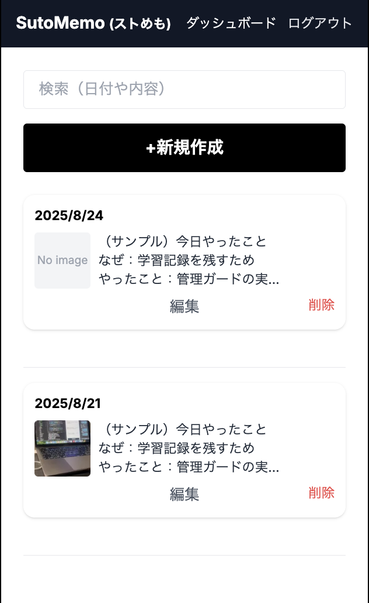
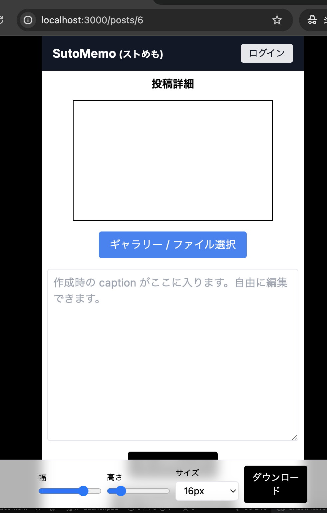
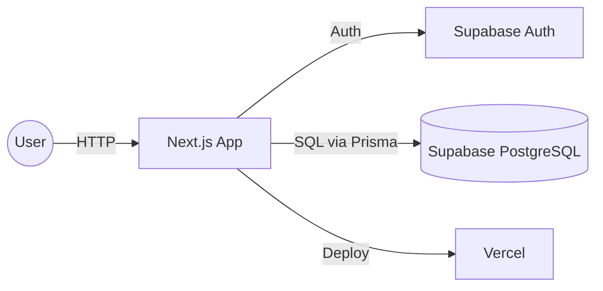
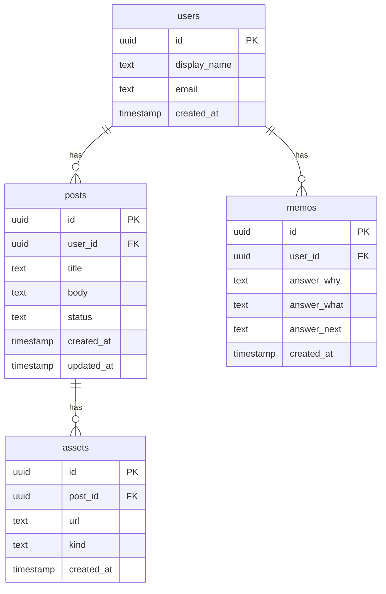

# SutoMemo
[](https://github.com/mashosokana/sutomemo/actions/workflows/e2e.yml)

**本番**: https://sutomemo.vercel.app  
**ゲストログイン**: トップの「お試しログイン」ボタンで即体験

**特徴（3つ）**
- LP → ワンクリック体験 → ダッシュボード（初回30秒）
- 投稿下書き生成 / 画像オーバーレイ（ウォーターマーク）
- X / Threads 共有導線 ＋ ふりかえりメモ（Why/What/Next）

# SutoMemo
[](https://github.com/mashosokana/sutomemo/actions/workflows/e2e.yml)

**学びをメモにし、投稿下書きと画像作成までを一続きにするWebサービス**

---

## リンク 
- **本番URL**：https://sutomemo.vercel.app  
- **ゲストログイン**：トップの「お試しログイン」ボタンで即体験（メール不要）

---

## このアプリの特徴は？
SNSや学習メモを**最短でアウトプット**するための個人開発アプリです。  
**LP → お試しログイン → ダッシュボード**までの導線を短く設計し、**行動（投稿/学習記録/画像作成）**がすぐ始まることを最優先にしています。

---

## 機能一覧

|  |  |
|---|---|
| トップ(LP) |  |
| ダッシュボード |  |
| 画像オーバーレイ |  |

---

## 機能一覧（抜粋）
- **初回体験の最短化**：LP→ワンクリック体験→ダッシュボード（**初回30秒**想定）
- **投稿下書き生成**：テンプレ × 生成APIで**10分でSNS量産**を支援
- **画像オーバーレイ**：キャンバスにテキスト/ロゴを重ねて書き出し（ウォーターマーク）
- **共有導線**：X / Threads へ即共有、コピー支援
- **学習メモ（Why/What/Next）**：振り返りを**1フォームで**蓄積
- **ゲストログイン**：メール不要で中身が見える

---

## 使用技術（Tech Stack）
| Category | Stack |
|---|---|
| Frontend | TypeScript, Next.js (App Router), Tailwind CSS, shadcn/ui |
| Backend | Next.js Route Handlers, Prisma |
| BaaS/DB | Supabase (Auth / PostgreSQL / RLS) |
| Infra | Vercel（Preview/本番デプロイ） |
| Test | Playwright（E2E） |
| CI/CD | GitHub Actions（E2E on prod） |
| Design/Docs | Figma, Mermaid |
| Others | ESLint, Prettier |

> 章立てや見せ方は、サンプルREADMEの体裁を参考にしています。:contentReference[oaicite:1]{index=1}

---

## システム構成（Mermaid）
```mermaid
flowchart LR
  User((User)) -->|HTTP| Next[Next.js App]
  Next -->|Auth| SupabaseAuth[Supabase Auth]
  Next -->|SQL via Prisma| DB[(Supabase PostgreSQL)]
  Next -->|Deploy| Vercel[Vercel]


This is a [Next.js](https://nextjs.org) project bootstrapped with [`create-next-app`](https://nextjs.org/docs/app/api-reference/cli/create-next-app).

## Getting Started

First, run the development server:

```bash
npm run dev
# or
yarn dev
# or
pnpm dev
# or
bun dev
```

Open [http://localhost:3000](http://localhost:3000) with your browser to see the result.

You can start editing the page by modifying `app/page.tsx`. The page auto-updates as you edit the file.

This project uses [`next/font`](https://nextjs.org/docs/app/building-your-application/optimizing/fonts) to automatically optimize and load [Geist](https://vercel.com/font), a new font family for Vercel.

## Learn More

To learn more about Next.js, take a look at the following resources:

- [Next.js Documentation](https://nextjs.org/docs) - learn about Next.js features and API.
- [Learn Next.js](https://nextjs.org/learn) - an interactive Next.js tutorial.

You can check out [the Next.js GitHub repository](https://github.com/vercel/next.js) - your feedback and contributions are welcome!

## Deploy on Vercel

The easiest way to deploy your Next.js app is to use the [Vercel Platform](https://vercel.com/new?utm_medium=default-template&filter=next.js&utm_source=create-next-app&utm_campaign=create-next-app-readme) from the creators of Next.js.

Check out our [Next.js deployment documentation](https://nextjs.org/docs/app/building-your-application/deploying) for more details.


## システム構成（Mermaid）


## ER図（Mermaid）

